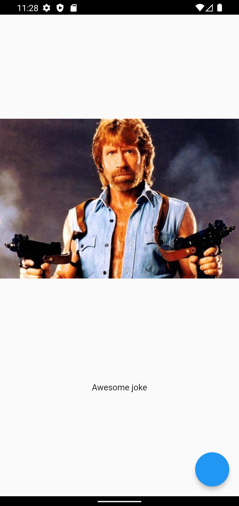
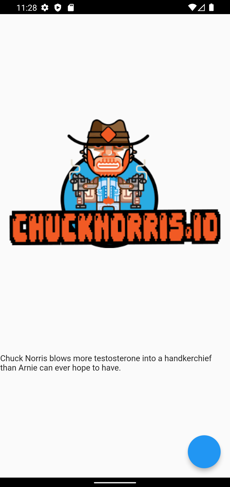

# Chuck Norris joke application

## Description
The application displays various jokes about Chuck Norris to the user. The information is obtained through the REST API. Inside the application, JSON is deserialized and the resulting joke is displayed on the screen.

## How it looks

